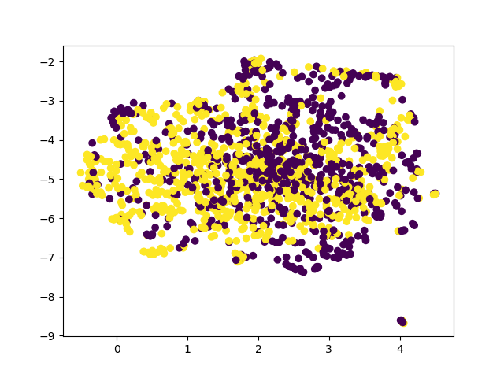

# binit-take-home-task
## Install Requirements
```pip install -r requirements.txt```

## Generate Plot
```python plot.py <path to output directory>```



## Description
* Used 2 classes from the CIFAR-10 dataset (automobile and frog), and used a subset of 1500 total images
* Used Resnet-50 model
* Extracted features from penultimate layer of the network
* Used UMap to reduce these features to a 2d embedding space
* Plotted data on the 2d embedding space to produce the plot shown above
    * The 2 classes are roughly split into clusters on the left and right
    * Initially, my plots did not have clusters, but I fixed this by normalizing the data and lowering the min_dist parameter of UMap
